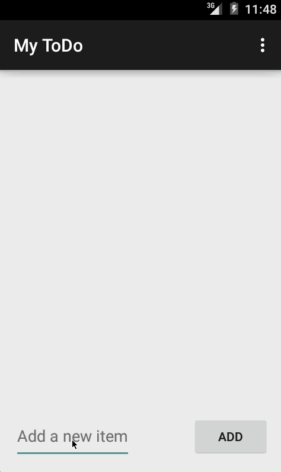

# Todo Application

This is ToDo application for Android Bootcamp pre-work. The application
is created based on instructions on [pre-work instruction](http://courses.codepath.com/snippets/intro_to_android/prework).

Time Spent : __~ 3 hours spent in total__

### Completed user stories : ###

* __Required__ : Add and remove items from the todo list within the app
* __Required__ : Edit todo items
* __Required__ : Persist todo items into local file
* __Optional__ : Empty string check on adding and editing todo items

